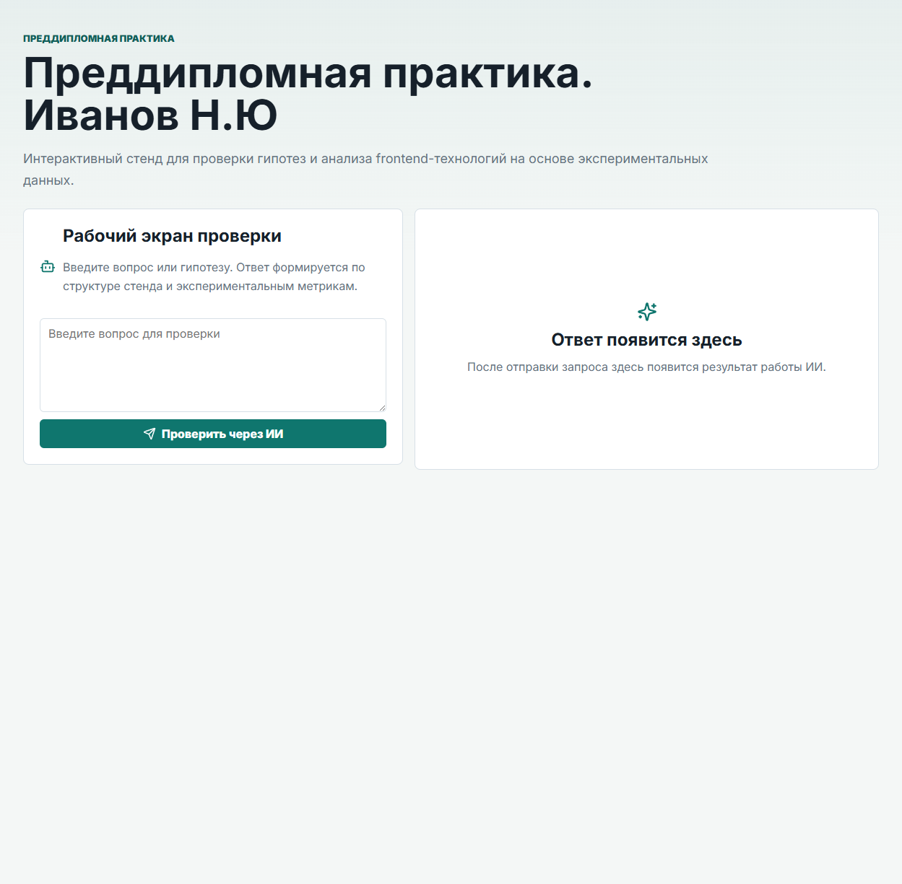
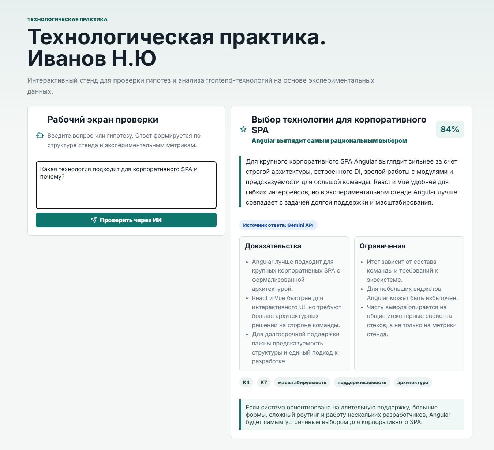

# Технологическая практика. Иванов Н.Ю

Интерактивный стенд для проверки гипотез и анализа frontend-технологий на основе экспериментальных данных. Проект запускает веб-интерфейс, серверный API для Gemini и контейнеризированный стенд для локальной демонстрации.

## Название работы

**Сравнительный анализ технологии Web Components и современных фронтенд-фреймворков для разработки пользовательских интерфейсов**

Тема реализации: интерактивный веб-ресурс для экспериментальной проверки гипотез о применимости Web Components и frontend-фреймворков.

## Что умеет проект

- принимает вопрос пользователя в веб-интерфейсе;
- сопоставляет вопрос со структурой гипотез H1-H5;
- отправляет контекст на серверный API;
- получает ответ от Gemini API;
- показывает вердикт, доказательства, ограничения и рекомендации;
- отдает экспериментальные артефакты в `docs/experiment-results`.

## Стек

- `React + Vite`
- `Node.js`
- `Docker + docker-compose`
- `Gemini API`

## Запуск проекта

### 1. Подготовить Gemini API key

Ключ берется в Google AI Studio:

- `https://aistudio.google.com/app/apikey`
- документация: `https://ai.google.dev/gemini-api/docs/api-key`

Быстрый способ записать ключ в `.env`:

```powershell
cd C:\Users\pepe\Desktop\web-components
.\scripts\setup-gemini-key.ps1
```

Скрипт создаст локальный `.env` со значениями:

```env
GEMINI_API_KEY=your-key
GEMINI_MODEL=gemini-2.5-flash-lite
PORT=80
```

### 2. Запустить контейнер

```powershell
docker compose up -d --build --force-recreate
```

### 3. Открыть проект

```text
http://127.0.0.1:8080
```

Проверка состояния сервера:

```text
http://127.0.0.1:8080/health
```

Ожидаемый ответ:

```json
{"ok":true,"provider":"gemini","geminiConfigured":true,"model":"gemini-2.5-flash-lite"}
```

## GitHub Pages

GitHub Pages отдает только статический frontend. Полноценная ИИ-проверка работает через локальный Docker-контейнер на `127.0.0.1:8080`, потому что серверный endpoint `/api/check-hypothesis` и API key нельзя безопасно размещать в статическом хостинге.

## Скриншоты

### Главная страница



### Пример ответа



## Полезные команды

Проверка сборки и тестов:

```powershell
npm run check
```

Сборка артефактов эксперимента:

```powershell
npm run experiment
```

Подготовка статической версии для GitHub Pages:

```powershell
npm run build:pages
```
